# 🏋️ SFA - Smart Fitness Assistant

<div align="center">


[](https://flutter.dev)
[](https://dart.dev)
[](LICENSE)
[](https://github.com/)

_Your Personal AI-Powered Fitness Companion_

</div>

## 📋 Overview

**SFA (Smart Fitness Assistant)** is a comprehensive mobile fitness application that leverages AI technology to provide personalized workout plans, meal planning, and fitness tracking. Built with Flutter and powered by Google Gemini AI, it offers an intelligent, adaptive approach to achieving your fitness goals.

## 📸 Screenshots

<div align="center">

### Authentication & Onboarding

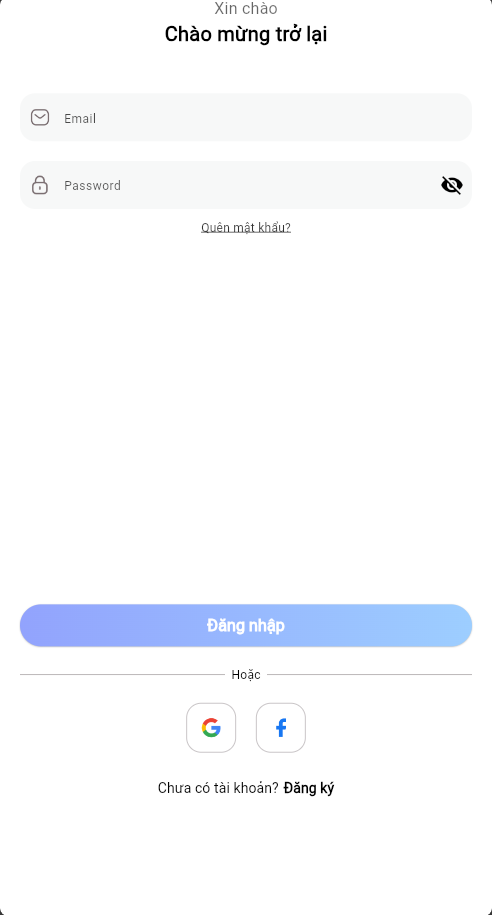 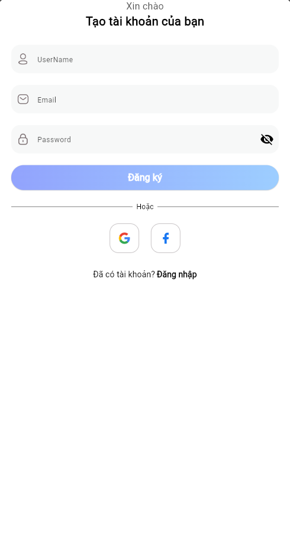 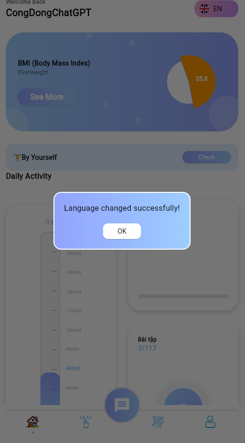

### Home & Dashboard

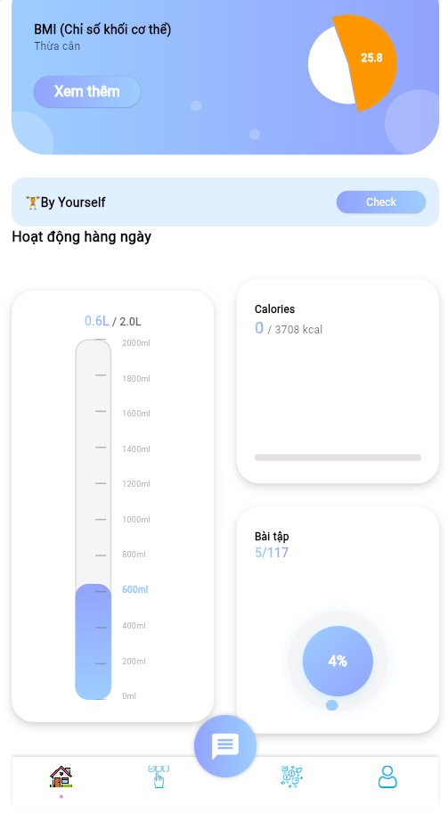 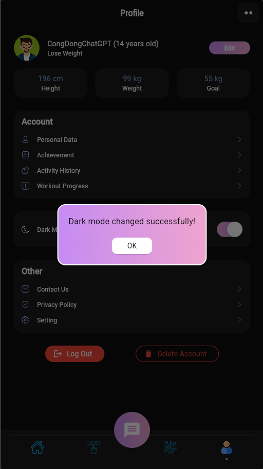 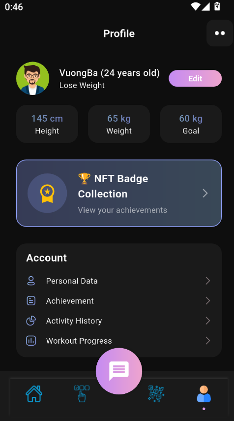

### Workout Features

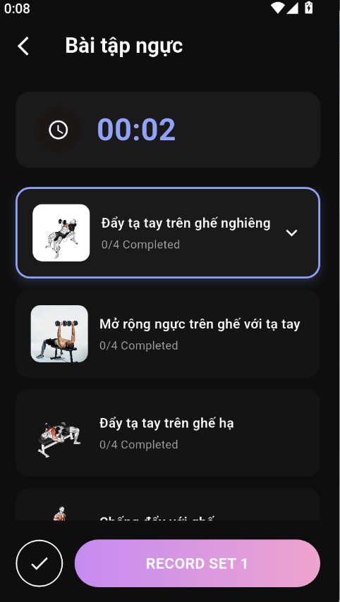 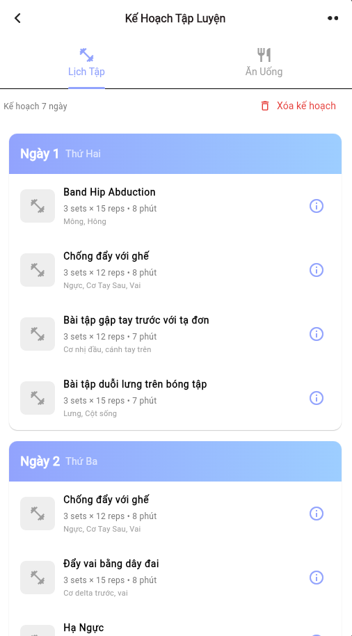 

### Nutrition & Hydration

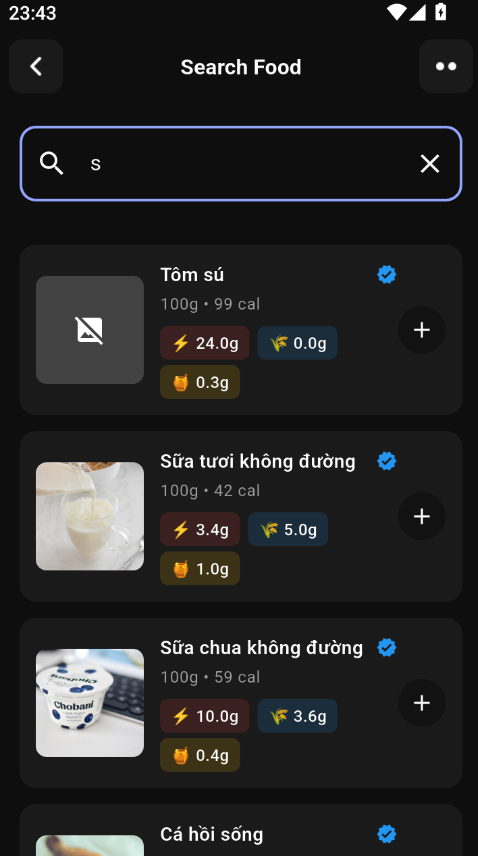 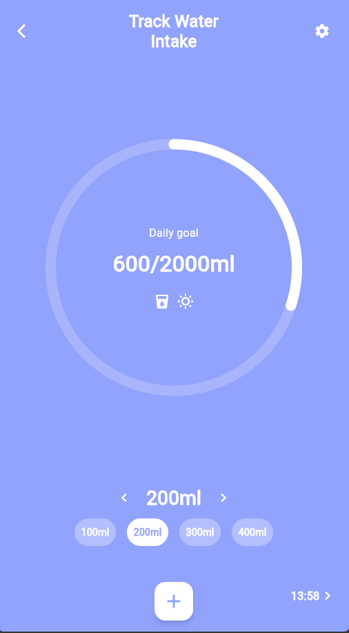

### AI & Achievements

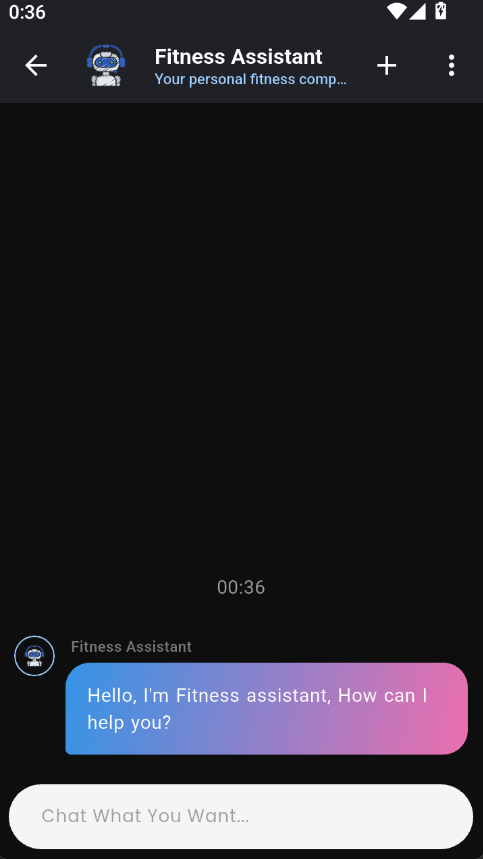 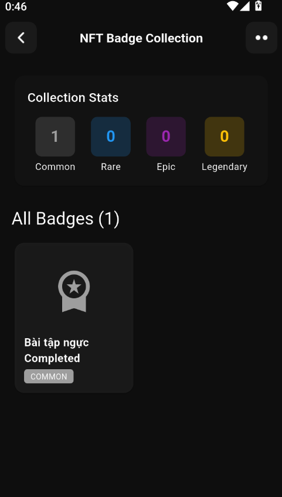 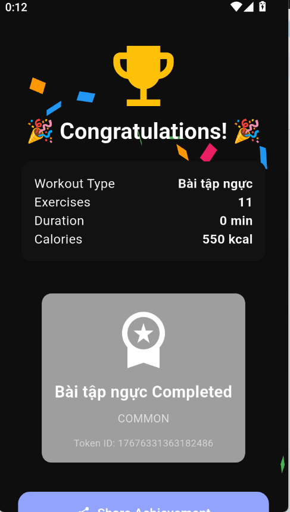

</div>

## ✨ Key Features

### 🤖 AI-Powered Planning

- **Intelligent Workout Plans**: 7-day personalized workout programs generated using Google Gemini AI
- **Custom Meal Planning**: AI-generated meal plans based on your dietary preferences, allergies, and caloric needs
- **Smart Recommendations**: Adaptive suggestions based on fitness level, equipment availability, and existing injuries

### 💪 Workout Management

- **Workout Tracker**: Track gym and home exercises with detailed logging
- **Exercise Library**: Comprehensive database of exercises with instructions and demonstrations
- **Real-time Progress**: Monitor sets, reps, duration, and calories burned
- **Injury-Aware**: Exercise filtering based on existing injuries and limitations
- **Equipment Flexibility**: Plans adapted for gym, home, or minimal equipment

### 🍽️ Nutrition Tracking

- **Meal Planner**: Log daily meals (breakfast, lunch, dinner, snacks)
- **Calorie Tracking**: Monitor daily caloric intake vs. goals
- **Macro Tracking**: Track protein, carbs, and fats
- **Food Database**: Searchable library with nutritional information
- **Custom Recipes**: Create and save your own recipes
- **Dietary Preferences**: Support for vegan, vegetarian, halal, low-carb, and high-protein diets

### 💧 Hydration Management

- **Water Tracker**: Set and track daily water intake goals
- **Smart Reminders**: Configurable notifications to maintain hydration
- **Progress Visualization**: Visual feedback on daily water consumption

### 📅 Schedule Management

- **Workout Calendar**: Plan and organize workout sessions
- **Flexible Scheduling**: Set recurring or one-time workout schedules
- **Push Notifications**: Timely reminders for scheduled workouts
- **Calendar Agenda**: Visual calendar interface for better planning

### 🏆 Achievements & Gamification

- **NFT Badges**: Earn unique NFT badges for workout completions
- **Rarity System**: Collect Common, Rare, Epic, and Legendary badges
- **Badge Showcase**: Display your achievements in your profile
- **Social Sharing**: Share achievements with the community

### 👥 Social Features

- **Fitness Feed**: Share workout progress and achievements
- **Community Interaction**: Like, comment, and engage with other users
- **Photo/Video Sharing**: Post workout photos and videos
- **Workout Tagging**: Tag workouts in your posts

### 🤖 AI Chatbot

- **Fitness Assistant**: Get instant answers to fitness and nutrition questions
- **Personalized Advice**: Context-aware recommendations powered by Google Gemini
- **24/7 Support**: Always available to help with your fitness journey

### 📊 Progress Analytics

- **BMI Calculator**: Track Body Mass Index over time
- **Weight Progress**: Monitor weight changes toward your goal
- **Activity Statistics**: Visualize workout frequency and intensity
- **Nutrition Insights**: Daily and weekly nutrition summaries

### 🎨 User Experience

- **Multi-language Support**: English (EN) and Vietnamese (VI)
- **Dark/Light Theme**: Customizable theme preferences
- **Responsive Design**: Optimized for all screen sizes
- **Smooth Animations**: Polished UI with engaging animations

## 🛠️ Tech Stack

### Core Framework

- **Flutter 3.9.2+** - Cross-platform mobile framework
- **Dart 3.9.2+** - Programming language

### State Management & Architecture

- **flutter_bloc 9.1.1** - BLoC pattern implementation
- **GetX 4.7.2** - Navigation and dependency injection
- **Cubit** - Lightweight state management

### Backend & Database

- **Supabase 2.10.3** - Backend as a Service (BaaS)
  - Authentication
  - PostgreSQL database
  - Real-time subscriptions
  - Storage for media files

### AI & ML

- **flutter_gemini 3.0.0** - Google Gemini AI integration
- **dash_chat_2 0.0.21** - AI chatbot interface

### UI Components & Libraries

- **fl_chart 1.1.1** - Advanced charting and data visualization
- **cached_network_image 3.4.1** - Efficient image loading and caching
- **lottie 3.3.2** - Smooth animations
- **carousel_slider 5.1.1** - Image carousels
- **simple_circular_progress_bar 1.0.2** - Progress indicators
- **animated_toggle_switch 0.8.5** - Custom switches
- **confetti 0.8.0** - Celebration effects

### Notifications & Scheduling

- **flutter_local_notifications 19.5.0** - Local push notifications
- **timezone 0.10.1** - Timezone handling for scheduling

### Storage & Persistence

- **shared_preferences 2.5.3** - Local key-value storage
- **flutter_secure_storage 9.2.2** - Secure credential storage

### Media & Utilities

- **image_picker 1.2.1** - Camera and gallery access
- **mobile_scanner 5.2.3** - QR/Barcode scanning
- **share_plus 12.0.1** - Native sharing functionality
- **url_launcher 6.3.1** - Open external URLs
- **permission_handler 11.3.1** - Runtime permissions

### Additional Libraries

- **intl 0.19.0** - Internationalization and localization
- **http 1.2.0** - HTTP client
- **uuid 4.0.0** - UUID generation
- **flutter_markdown 0.7.4** - Markdown rendering
- **readmore 3.0.0** - Expandable text widgets
- **dropdown_button2 2.3.8** - Enhanced dropdown buttons
- **animated_text_kit 4.3.0** - Text animations
- **dotted_dashed_line 0.0.3** - Custom line widgets

## 📁 Project Structure

```
lib/
├── main.dart                          # App entry point
├── core/                              # Core utilities
│   ├── functions/                     # Helper functions
│   ├── models/                        # Data models
│   ├── services/                      # Services (notifications, etc.)
│   ├── theme/                         # Theme configuration
│   └── widgets/                       # Reusable widgets
├── locale/                            # Internationalization
│   ├── lang_en.dart                   # English translations
│   ├── lang_vi.dart                   # Vietnamese translations
│   ├── locale_key.dart                # Translation keys
│   └── translation_manager.dart       # Translation manager
└── views/                             # Feature modules
    ├── achievements/                  # NFT badges & achievements
    ├── activity_level/                # Activity level tracking
    ├── auth/                          # Authentication & onboarding
    ├── chatbot/                       # AI chatbot
    ├── exercise_session/              # Active exercise sessions
    ├── home/                          # Dashboard
    ├── meal_planner/                  # Nutrition tracking
    ├── multi_step_dialog_workout/     # Workout plan wizard
    ├── onboarding/                    # First-time user experience
    ├── profile/                       # User profile
    ├── schedule_management/           # Workout scheduling
    ├── social/                        # Social feed
    ├── water_tracker/                 # Hydration tracking
    ├── workout_plan/                  # AI workout plan generation
    └── workout_tracker/               # Workout logging
```

## 🚀 Getting Started

### Prerequisites

- Flutter SDK 3.9.2 or higher
- Dart SDK 3.9.2 or higher
- Android Studio / Xcode (for mobile development)
- Git

### Installation

1. **Clone the repository**

   ```bash
   git clone <repository-url>
   cd smart_fitness_assistant
   ```

2. **Install dependencies**

   ```bash
   flutter pub get
   ```

3. **Configure Supabase**

   - Create a Supabase project at [supabase.com](https://supabase.com)
   - Update `lib/core/sensitive_data.dart` with your credentials:
     ```dart
     const String anonKey = 'YOUR_SUPABASE_ANON_KEY';
     const String apiKey = 'YOUR_GEMINI_API_KEY';
     ```

4. **Configure Firebase (for Android)**

   - Add your `google-services.json` to `android/app/`

5. **Run the app**
   ```bash
   flutter run
   ```

## 🔧 Configuration

### Environment Setup

Create a `lib/core/sensitive_data.dart` file with your API keys:

```dart
// Google Gemini AI API Key
const String apiKey = 'YOUR_GEMINI_API_KEY';

// Supabase Anon Key
const String anonKey = 'YOUR_SUPABASE_ANON_KEY';
```

### Supabase Database Setup

Refer to `LOCALE_SUPABASE_GUIDE.md` for detailed database schema and setup instructions.

## 📱 Supported Platforms

- ✅ Android
- ✅ iOS
- ✅ Web
- ✅ Windows
- ✅ macOS
- ✅ Linux

## 🌐 Localization

The app supports multiple languages:

- 🇬🇧 English (EN)
- 🇻🇳 Vietnamese (VI)

To add a new language:

1. Create a new translation file in `lib/locale/` (e.g., `lang_es.dart`)
2. Add all translation keys from `locale_key.dart`
3. Register in `translation_manager.dart`

## 🏗️ Architecture

The app follows a **BLoC (Business Logic Component)** architecture pattern:

- **Presentation Layer**: UI widgets and screens
- **Business Logic Layer**: Cubits/BLoCs for state management
- **Data Layer**: Repositories and data sources
- **Core Layer**: Shared utilities, models, and services

### Key Design Patterns

- **BLoC Pattern**: State management
- **Repository Pattern**: Data abstraction
- **Dependency Injection**: Service location via GetX
- **MVVM**: Model-View-ViewModel separation

## 🔐 Authentication & Security

- Email/Password authentication via Supabase Auth
- Secure storage for sensitive data using `flutter_secure_storage`
- JWT token-based session management
- Password reset and email verification

## 📊 Database Schema

The app uses Supabase (PostgreSQL) with the following main tables:

- `users` - User profiles and settings
- `workouts` - Workout sessions
- `exercises` - Exercise library
- `meals` - Meal records
- `schedules` - Workout schedules
- `badges` - NFT achievements
- `posts` - Social feed posts
- `comments` - Post comments


## 🙏 Acknowledgments

- Google Gemini AI for intelligent recommendations
- Supabase for backend infrastructure
- Flutter community for excellent packages and support
- All contributors and testers

---

<div align="center">

**Built with Flutter 💙**

_Stay fit, stay smart!_ 🏋️‍♂️💪

</div>
